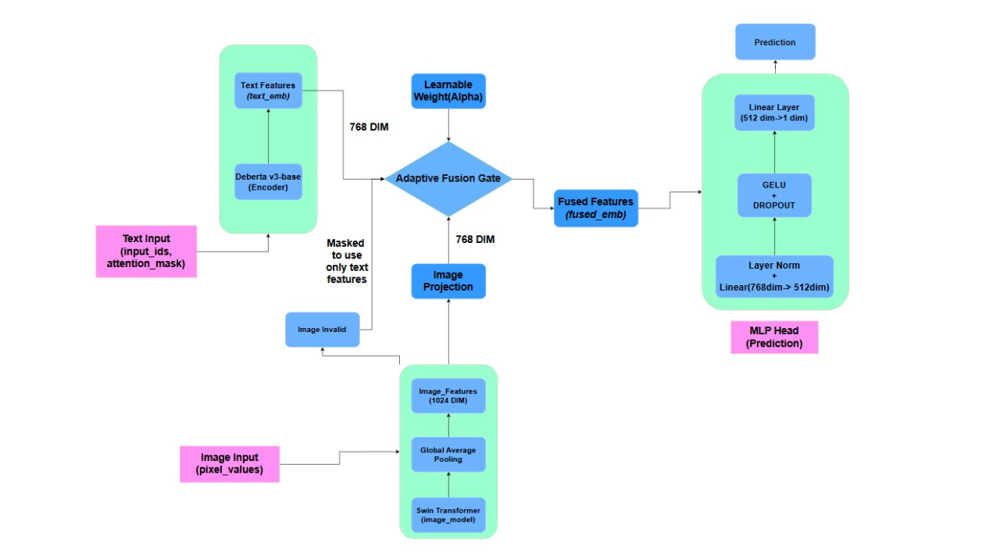

# ML Challenge 2025: Smart Product Pricing Solution (Updated)

**Team Name:** CIPHER
**Team Members:** Mohammad Muzammil, Harshit Maurya, Khush Kataruka, Vedang Dubey
**Submission Date:** 13-10-2025

## 1. Executive Summary

We developed a multi-modal deep learning model that adaptively fuses textual product descriptions and visual images for accurate price prediction. Our solution leverages state-of-the-art transformer models—**DeBERTa-v3 for text** and a **Swin Transformer for images**—to extract rich, contextual features. 

## 2. Methodology Overview

### 2.1 Problem Analysis

Product pricing is inherently multi-modal, depending on both textual attributes and visual cues. The primary challenges are handling imperfect data, such as missing images, and managing a long-tail price distribution.

### 2.2 Solution Strategy

Our strategy is a multi-modal architecture using fine-tuned DeBERTa-v3 (text) and Swin Transformer (image) models. The core of our solution is a learnable fusion parameter (α) that dynamically balances the importance of text versus images based on data quality. The model is trained end-to-end with a SMAPE loss function to optimize for relative pricing accuracy.

## 3. Model Architecture

### 3.1 Architecture Overview

### 3.2 Model Components

-   **Text Pipeline**:
    -   **Model**: `microsoft/deberta-v3-base`
    -   **Output Dimension**: 768
    -   **Tokenization**: Max length set to 256 tokens with padding and truncation.

-   **Image Pipeline**:
    -   **Model**: Swin Transformer (`swin_base_patch4_window7_224.ms_in22k`)
    -   **Output Dimension**: 1024
    -   **Preprocessing**: Images are resized to 224×224 and normalized.

-   **Fusion Mechanism**:
    -   **Alignment**: A linear layer projects the 1024-dim image features to the 768-dim text feature space.
    -   **Adaptive Weighting**: A learnable weight, $\alpha$, is passed through a sigmoid function to scale modality contributions. A binary mask handles missing images. The fusion is performed using the formula:
        $$\text{FusedEmb} = (\alpha \cdot \text{ImgEmb} \cdot \text{Mask}) + ((1 - \alpha \cdot \text{Mask}) \cdot \text{TextEmb})$$

-   **Prediction Head**:
    -   **Architecture**: A sequential MLP consisting of `LayerNorm -> Linear(768, 512) -> GELU -> Dropout(0.1) -> Linear(512, 1)`.

-   **Training**:
    -   **Optimizer**: AdamW with a learning rate of $2 \times 10^{-5}$.
    -   **Loss Function**: A custom **SMAPE loss** for robust backpropagation.
    -   **Scheduler**: Cosine schedule with warmup (100 steps).
    -   **Regularization**: Dropout (0.1) and gradient clipping (max norm of 1.0).
    -   **Batch Size**: 25.

## 4. Model Performance

### 4.1 Validation Results

*The following metrics were achieved during our final training run.*

| Metric | Value |
| :--- | :--- |
| **Best Test SMAPE** | **45.18%** |
| Final Train SMAPE | 17.97% |
| Best Validation SMAPE | 44.103% |

### 4.2 Key Strengths

-   **Robustness**: Gracefully handles missing or corrupt images using the masking mechanism.
-   **Adaptability**: The learnable fusion weight ($\alpha$) allows the model to dynamically balance the importance of text vs. image data.
-   **Performance**: Achieves competitive accuracy by leveraging powerful pre-trained DeBERTa and Swin models.
-   **Interpretability**: The learned value of $\alpha$ can provide insights into whether text or images are generally more predictive for the dataset.

## 5. Conclusion

### 🎯 Key Achievements

We designed a production-ready, adaptive multi-modal architecture that achieves competitive accuracy while robustly managing real-world data imperfections.

### 📈 Impact and Applications

This solution is ideal for e-commerce dynamic pricing, marketplace price consistency, and financial market monitoring.

### 🔮 Future Enhancements

Future work includes incorporating metadata, using model ensembles, and integrating temporal data to capture price trends.

### 💡 Lessons Learned

- Balanced Fusion is Critical: An adaptive fusion mechanism significantly outperforms fixed-ratio methods.

- SMAPE-Guided Training: Training directly on a SMAPE-based loss aligns optimization with the final metric, improving results.

- Error Handling is Essential: A robust data loader that handles corrupt files is vital for stable training.

### 🚀 Final Remarks

Our solution effectively combines the power of modern transformers with a novel adaptive fusion technique to predict product prices accurately while demonstrating resilience to real-world data challenges.

## Appendix

### A. Code Artefacts
[Google Drive Link](https://drive.google.com/drive/folders/1kGa_De2G-7vnz4eAdsj-smvfBJp3NYqW?usp=sharing)

### B. Additional Results

✅ Using device: `cuda`
📦 Data split: 56000 train, 14000 val, 5000 test
🚀 Training for 25 epochs with a batch size of 25. Best Test SMAPE achieved: **44.18%**.